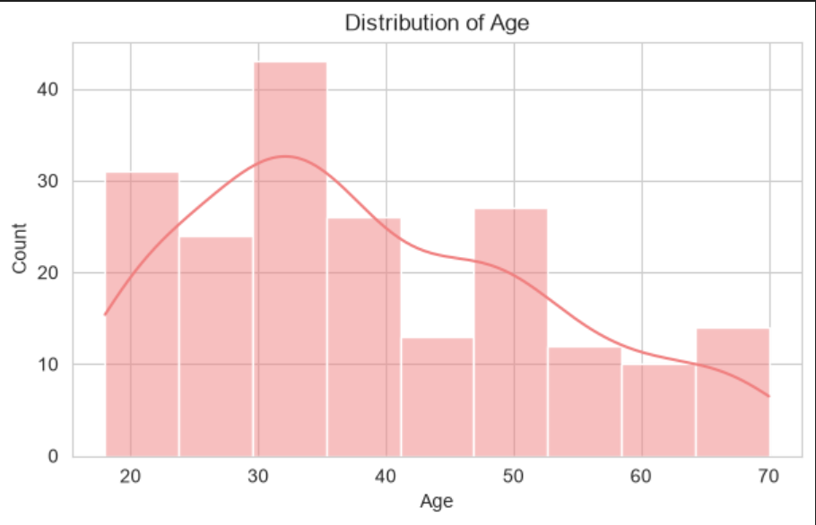
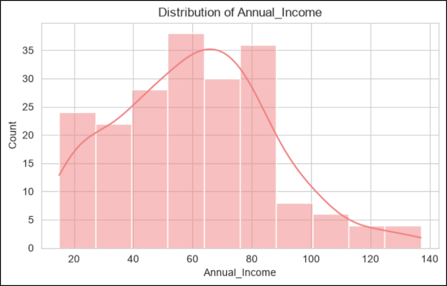
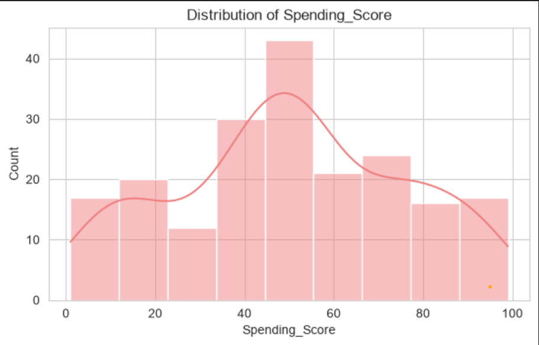
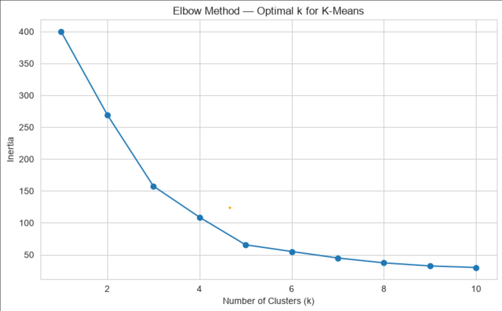
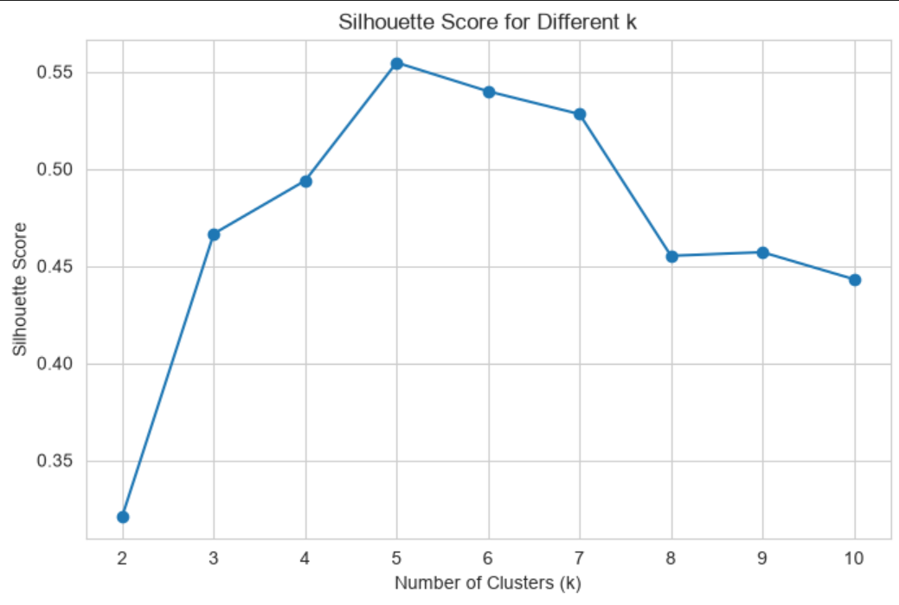
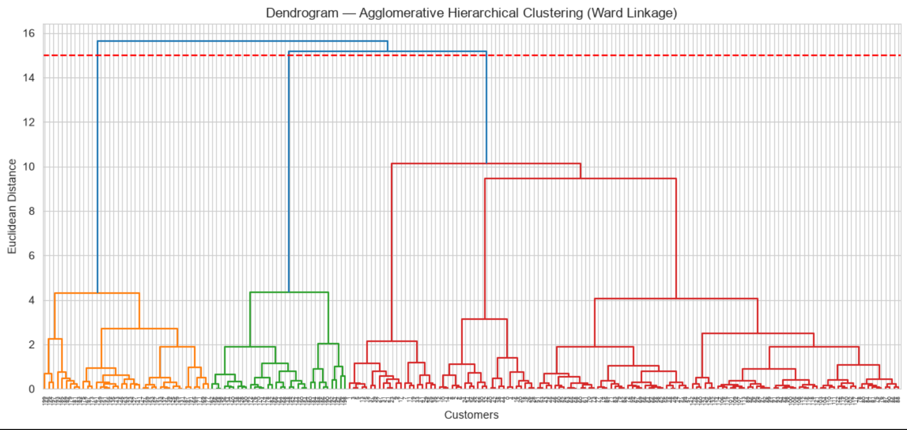
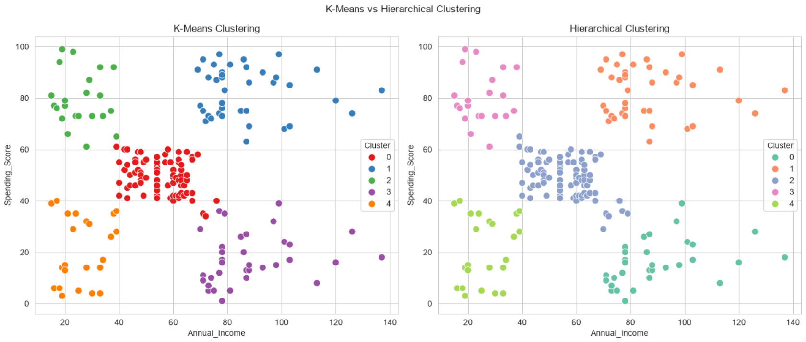
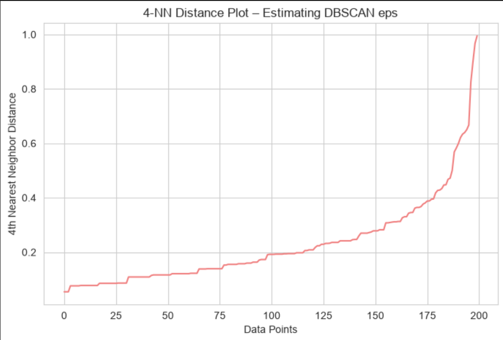
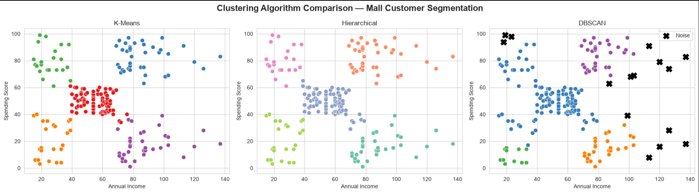

<div align="center">

# 🛍️✨ Mall Customer Segmentation ✨🛍️

### *Unsupervised Learning — PR 1*


<br>


<p align="center">
  <i>🎯 Segmenting mall customers by income & spending behavior — three algorithms, one dataset, side by side.</i>
</p>

<p align="center">
  <a href="#-dataset">📂 Dataset</a> •
  <a href="#-algorithms-used">🧠 Algorithms</a> •
  <a href="#-results--visualizations">📊 Results</a> •
  <a href="#-business-insights">💡 Insights</a> •
  <a href="#-video-walkthrough">🎥 Video</a> •
  <a href="#️-how-to-run">⚙️ Setup</a>
</p>

---

</div>

## 🌟 Project at a Glance

<table>
<tr>
<td width="50%" valign="top">

**🏫 Institute**
Red & White Skill Education

**📚 Subject**
Unsupervised Learning

**📝 Assignment**
Practical Report 1 (PR 1)

</td>
<td width="50%" valign="top">

**🧮 Algorithms**
K-Means · Hierarchical · DBSCAN

**📊 Dataset**
200 records · 5 columns · 0 nulls

**🏆 Best Model**
K-Means (Silhouette = 0.555)

</td>
</tr>
</table>

> 💬 **In one line:** Using only `Annual Income` and `Spending Score`, three unsupervised algorithms independently converge on the *same 5 customer personas* — giving a mall marketing team a data-backed, ready-to-use segmentation strategy.

---

## 📂 Dataset


**Mall Customer Segmentation Data** · sourced from Kaggle · `CC0: Public Domain`

🔗 **[View Dataset on Kaggle →](https://www.kaggle.com/datasets/vjchoudhary7/customer-segmentation-tutorial-in-python)**

| Column | Type | Description |
|---|:---:|---|
| `CustomerID` | 🔢 Int | Unique ID — dropped before modeling |
| `Gender` | 🚻 Category | Male / Female → encoded 0 / 1 |
| `Age` | 🎂 Int | 18 – 70 years |
| `Annual_Income` | 💰 Float | Estimated income in $k (15 – 137) |
| `Spending_Score` | 🛒 Int | Mall-assigned score, 1 (low) → 100 (high) |

<br>

**🔧 Preprocessing pipeline:**

```
Raw CSV → Rename columns → Drop CustomerID → Encode Gender
        → StandardScaler(Age, Income, Score) → df_2f (Income, Score)
```

---

## 🧠 Algorithms Used

<table>
<tr>
<td width="33%" align="center" valign="top">

### 1️⃣
### K-Means
**Centroid-based**

Partitions customers into *k* groups by minimizing distance to cluster centers.

`k=5` chosen via Elbow + Silhouette.

✅ Most interpretable
✅ Best for stakeholder reporting

</td>
<td width="33%" align="center" valign="top">

### 2️⃣
### Hierarchical
**Connectivity-based**

Bottom-up merging using **Ward linkage**, visualized as a dendrogram.

✅ Reveals nested structure
✅ Great for presentations

</td>
<td width="33%" align="center" valign="top">

### 3️⃣
### DBSCAN
**Density-based**

Groups dense regions, flags sparse points as **noise** — no `k` required.

✅ Finds arbitrary shapes
✅ Built-in outlier detection

</td>
</tr>
</table>

---

## 📊 Results & Visualizations

<div align="center">

### 🔍 Exploratory Data Analysis

</div>

<table>
<tr>
<td></td>
<td></td>
<td></td>
</tr>
<tr>
<td align="center"><sub><b>Age</b> — skews 25–40</sub></td>
<td align="center"><sub><b>Annual Income</b> — spread $15k–$137k</sub></td>
<td align="center"><sub><b>Spending Score</b> — evenly distributed</sub></td>
</tr>
</table>

<br>

<div align="center">

### 🎯 K-Means — Finding the Optimal *k*

<table>
<tr>
<td></td>
<td></td>
</tr>
</table>

> 📌 **Both methods agree → `k = 5` is optimal**, balancing compactness (low inertia) with separation (high silhouette).

</div>

<br>

<div align="center">

### 🌳 Agglomerative Hierarchical Clustering



*Cutting at the tallest uncrossed gap (red dashed line) yields 5 clusters — matching K-Means.*

</div>

<br>

<div align="center">

### ⚖️ K-Means vs Hierarchical — Head to Head



*Nearly identical boundaries — only a handful of border customers are assigned differently.*

</div>

<br>

<div align="center">

### 📈 DBSCAN — Estimating `eps`



*The "knee" in the curve (~0.4) guides the eps choice, later confirmed via full grid search.*

</div>

<br>

<div align="center">

### 🏁 Final Showdown — All Three Algorithms



</div>

<div align="center">

### 📋 Metrics Scoreboard

| 🧮 Algorithm | 🔢 Clusters | ⭐ Silhouette Score | 🏅 Rank |
|:---|:---:|:---:|:---:|
| **K-Means** | 5 | **0.555** | 🥇 |
| **Hierarchical** | 5 | 0.554 | 🥈 |
| **DBSCAN** | 4 | 0.478 | 🥉 |

</div>

---

## 💡 Business Insights

<table>
<tr><th>Segment</th><th>Profile</th><th>Recommended Action</th></tr>
<tr><td>🟢 <b>High Income / High Spending</b></td><td>Premium, high-revenue customers</td><td>VIP loyalty rewards & memberships</td></tr>
<tr><td>🔵 <b>High Income / Low Spending</b></td><td>High potential, low engagement</td><td>Personalized, targeted offers</td></tr>
<tr><td>🟠 <b>Low Income / High Spending</b></td><td>Value-driven, frequent shoppers</td><td>Budget bundles & flash promotions</td></tr>
<tr><td>🟣 <b>Low Income / Low Spending</b></td><td>Occasional, low-value visitors</td><td>Low-cost seasonal campaigns</td></tr>
<tr><td>🔴 <b>Average Income / Average Spending</b></td><td>Stable, routine shoppers</td><td>Consistent engagement offers</td></tr>
</table>

> 🏆 **Recommended for deployment:** **K-Means** — the clearest, most stakeholder-friendly segmentation. **Hierarchical** is the best backup when a dendrogram aids a management presentation. **DBSCAN** shines specifically for outlier / anomaly detection.

---

## 🎥 Video Walkthrough

<div align="center">

📹 **[▶️ Watch the Full Walkthrough](https://drive.google.com/file/d/1x7Z5-dsnQhkEZBBU1mIG0NjmliUuaG_A/view?usp=sharing)**

**Covers:** scaling rationale → Elbow/Silhouette reasoning → reading the dendrogram → DBSCAN tuning → algorithm comparison → business insights

</div>

---

## 🛠️ Tools & Tech Stack

<div align="center">


</div>

---

## 📁 Repository Structure

```
📦 mall-customer-segmentation
 ┣ 📓 UL_PR1.ipynb                 → Full analysis notebook (all 7 tasks)
 ┣ 🌐 UL_PR1.html                  → Exported HTML version
 ┣ 📁 Images/                      → All plots & screenshots
 ┃ ┣ 🖼️ Distribution_of_age.png
 ┃ ┣ 🖼️ Distribution_of_Annual_Income.png
 ┃ ┣ 🖼️ Distribution_of_Spending_Score.png
 ┃ ┣ 🖼️ Elobw_method.png
 ┃ ┣ 🖼️ Silhouette_Score_for_Different_k.png
 ┃ ┣ 🖼️ Dendrogram.png
 ┃ ┣ 🖼️ K-Means_vs_Hierarchical_Clustering.png
 ┃ ┣ 🖼️ 4-NN_Distance_Plot.png
 ┃ ┗ 🖼️ Clustering_Algorithm_Comparison.png
 ┣ 📋 requirements.txt             → Reproducible environment
 ┗ 📖 README.md                    → You are here
```

---

## ⚙️ How to Run

```bash
# 1️⃣ Clone the repository
git clone https://github.com/<your-username>/mall-customer-segmentation.git
cd mall-customer-segmentation

# 2️⃣ Install dependencies
pip install -r requirements.txt

# 3️⃣ Launch the notebook
jupyter notebook UL_PR1.ipynb
```

<details>
<summary>📋 <b>Click to view requirements.txt</b></summary>

```
pandas==2.2.2
numpy==1.26.4
matplotlib==3.8.4
seaborn==0.13.2
scikit-learn==1.4.2
scipy==1.13.0
```

</details>

---

<div align="center">

### 📜 License & Credits

Dataset licensed under **CC0: Public Domain** · Notebook & analysis © 2026


⭐ *If this project helped you, consider giving the repo a star!* ⭐

</div>
